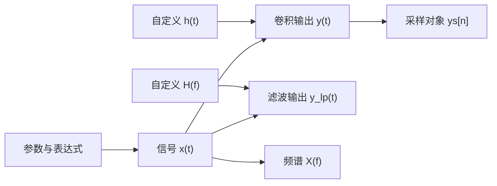

# Clab：北邮 801 通信原理交互实验室需求

> 版本：v0.2 ｜ 更新：2026-10-08 ｜ 状态：需求草案，尚未进入开发
>
> 核心定位：以北邮 801 通信原理相关知识为内容边界，提供类似 GeoGebra 的自由计算与可视化工作台。用户能够输入信号和滤波器表达式、建立相互关联的对象、调节参数并观察变化。重点是理解与探索，章节只作为内容映射，解题训练是可选扩展。

## 1. 项目目标与需求依据

### 1.1 用户明确提出的目标

- 提供一个可交互的“实验室”，能够主动操作，而不只是阅读文字或观看固定动画。
- 将公式、计算关系和抽象概念转化为直观的波形、频谱、几何图形与变化过程。
- 帮助理解“一个量变化，为什么另一个量会变化”，并形成容易回忆的视觉印象。
- 主要服务知识理解；题目、答题技巧、刷题和评分不作为核心功能。
- 除了操作预设和滑块，还能直接输入特定信号、滤波器及运算的式子，观察自己的信号经过变换或系统后的结果。
- 提供内置数学键盘，便于输入分式、上下标、希腊字母、复数及通信原理常用函数与符号。
- 以关联紧密的对象和操作组织工作台，同一界面内自由组合；只有关联较远的内容才分成功能分类，例如波形调制与编码。

本版据此将“独立实验页面”的方案调整为“共享工作台 + 可组合工具 + 可编辑示例场景”。表达式输入和数学键盘是首版核心能力。

### 1.2 本文采用的产品假设

- 初期面向个人学习，优先在电脑浏览器中使用。
- 默认采用中文说明，保留通信领域常见英文缩写。
- 先提供完整的自由输入、对象联动与绘图能力，再用少量示例验证其学习价值，逐步扩展工具。
- 不预先绑定某本教材的章节顺序；后续可以增加教材目录映射。
- 工作区目前只有需求文档，尚无需要继承的应用架构。

以上是为了形成可实施方案而提出的建议，不等同于用户已经指定了技术选型或全部功能。

### 1.3 考纲来源与核验边界

截至本次整理，已通过检索读取到北邮 **2025 年官方考纲**的 801 内容，包含八个知识板块，可作为本版需求的明确来源：[北邮研究生招生网：2025 年自命题考试大纲](https://yzb.bupt.edu.cn/info/1010/1045.htm)。

同时检索到 [2027 年考纲发布信息的转载](https://www.chinakaoyan.com/graduate/info/nid/674121/schoolID/94.shtml)，以及其对应的[北邮官方公告地址](https://yzb.bupt.edu.cn/info/1010/1455.htm)。本次读取该官方页面及附件时返回访问错误，**尚未核验 2027 年 801 正文，不能宣称本文已经逐项对齐最新版考纲**。

关于版本差异，[2026 年 801 考纲转载](https://www.chinakaoyan.com/graduate/info/nid/617447/schoolID/94.shtml)与[另一份 2026 年转载](https://www.gaodun.com/kaoyan/1716909.html)可以交叉参考，但不替代官方原文核验。本文将其中涉及的载波同步、交织等安排为候选扩展；历史考纲中的部分响应、哈夫曼编码、Rake、载波频偏等保留为理解性拓展，不据此断言目标年度仍逐项要求。

目标考试年份和使用教材尚未指定。后续取得目标年度官方正文时，应更新“知识点—实验”映射及范围标签，无须因此重做实验室的通用交互结构。

## 2. 什么样的实验算有学习价值

用户可以从空白工作台直接开始，也可以打开一个可编辑示例，例如“为什么频率变高，波形变密”“为什么脉冲相互重叠却仍可能没有码间干扰”。预设用于帮助起步，不限制后续操作。

推荐的学习过程是：

**输入或选择对象 → 建立运算关系 → 改变表达式或参数 → 观察现象 → 对照公式 → 解释原因 → 保存场景与发现。**

观察提示可以鼓励用户先预测再解释，也可随时关闭，不打断自由探索。系统无需判断用户是否答对。

实验设计需遵循以下原则：

1. **先看现象，再展开数学。** 初始状态呈现一个明确、容易辨认的变化，公式和推导按需展开。
2. **一个控件对应一个有意义的变量。** 用户知道在调什么、单位是什么、哪些条件保持不变。
3. **同一对象跨视图联动。** 一个符号、一个采样点或一段信号，可以在时域、频域、星座图和公式中互相定位。
4. **允许比较与反例。** 能够并排比较两组条件，观察“直觉不成立”的情况及其原因。
5. **区分理论与数值实验。** 理想模型、有限采样、随机统计、近似公式必须有清楚标记。
6. **每个实验有可表达的结论。** 用户能够用自己的话描述观察到的关系，而不是只看到一张漂亮的图。
7. **工具与表达式相通。** 通过按钮添加的信号、滤波器或变换，应生成可检查、可修改的对象定义；直接输入得到的对象也能使用相同工具。
8. **按关系探索。** 在信号对象上做滤波、调制、频谱分析和采样时，不需要先切换教材章节或重新输入同一个信号。

## 3. 范围与优先级

### 3.1 主界面按三个工作台组织

以下分类依据对象、数据类型和操作之间的关联，不按考纲章节排序。三个工作台沿用同一套输入区、对象列表和可视化布局，只调整常用工具与默认视图。

| 工作台 | 共同操作的对象与工具 | 集成的主要视图 |
| --- | --- | --- |
| W1. 信号与系统 | 连续／离散信号、复信号、噪声、频谱、相关、滤波器、模拟调制、采样与量化 | 时域、频域、系统响应、包络／相位、统计图 |
| W2. 数字传输与接收 | 比特与符号、成形、I/Q、数字调制、信道、均衡、接收判决、扩频、OFDM | 波形、频谱、星座、判决区、眼图、通信链路各节点 |
| W3. 序列、信息与编码 | 概率分布、信息量、容量关系、码字、矩阵、多项式、编码器、序列发生器 | 概率图、编码树、矩阵、寄存器、状态图、格图 |

例如，W1 中同一条信号可以连续做“观察频谱 → 调制 → 通过自定义滤波器 → 观察恢复结果”，整个过程保留在一张工作台中。编码主要使用码字、矩阵和状态结构，与模拟波形操作距离较远，因此放入 W3。

噪声、滤波、信道和序列对象可以被多个工作台复用。分类决定常用工具的呈现，不构成计算能力的硬边界。首版至少完成 W1、W2 的基础能力；W3 在对应工具实现后开放，不以空页面宣称功能已经完成。

### 3.2 工作台内的自由度与跨工作台衔接

- 同一场景可同时存在多条信号、多个滤波器和多个处理分支，用户决定显示哪些对象、把哪些结果放到同一幅图比较。
- 参数、表达式、对象连接与视图是可编辑的，操作不受某个预设场景规定的步骤限制。
- 不限制为一条固定的“发射—信道—接收”流程；用户可以先定义滤波器，再添加信号，也可以只研究一个公式。
- 切换功能分类时保留各自的场景；同类操作不跳转到独立章节页面。
- P1 支持将对象及其必要依赖复制到另一工作台，或存入本地对象库后复用。首次实现采用独立副本，避免源场景变化意外影响其他场景；显式跨场景引用可作为后续增强。
- 比特序列到波形、连续信号到采样序列等连接，需要明确的映射或采样操作，保留速率与时间信息。

### 3.3 考纲仅作为覆盖映射

按已读取的 [2025 年北邮官方 801 考纲](https://yzb.bupt.edu.cn/info/1010/1045.htm)，保留八个知识板块与工具的对应关系，用于检查内容覆盖。它们不作为应用的一级导航。

| 考纲内容归纳 | 主要对应工作台 |
| --- | --- |
| 信号与随机过程 | W1；接收与噪声工具复用于 W2 |
| 模拟调制 | W1 |
| 数字基带传输 | W2；使用 W1 的信号与系统基础能力 |
| 数字频带传输 | W2 |
| 信源与信源编码 | 数字化在 W1，信息与编码在 W3，时隙组织在 W2 |
| 信道与容量 | 系统响应在 W1，传输信道在 W2，容量关系在 W3 |
| 信道编码 | W3 |
| 扩频与多载波 | 序列构造在 W3，传输与接收在 W2 |

完整规划需要覆盖各板块；**首版不承诺覆盖完整考纲**。工具目录清楚区分“可用”和“计划补充”。

### 3.4 优先级定义

| 优先级 | 含义 |
| --- | --- |
| P0 | 首版必须实现，形成可独立使用的实验体验 |
| P1 | 首版稳定后补充，扩大知识覆盖和比较深度 |
| P2 | 进一步拓展，包含历史范围、复杂模型或跨模块实验 |

优先级依据是直观收益、实现成本及基础能力复用，**不代表考试频率、分值或知识点重要性**。

## 4. 通用功能需求

| 编号 | 优先级 | 需求 | 可验收结果 |
| --- | --- | --- | --- |
| FR-01 | P0 | 工作台与工具目录 | 按 W1／W2／W3 组织功能；可搜索对象、运算、概念和示例，搜索结果可直接插入当前场景 |
| FR-02 | P0 | 示例与先修提示 | 示例说明可观察什么，必要时提示先修概念；用户可从空白场景开始 |
| FR-03 | P0 | 参数操控 | 提供滑块和精确输入，显示变量含义、单位、合法范围；非法输入得到就地提示 |
| FR-04 | P0 | 多视图联动 | 表达式或参数改变后，所有受影响对象、图像与读数一致更新；鼠标可读取关键点 |
| FR-05 | P0 | 公式解释 | 显示公式、符号含义、适用条件；重点变量可与图中对象对应 |
| FR-06 | P0 | 可编辑示例场景 | 首版各观察主题至少提供三组预设；打开后可添加、删除和组合对象，另存为自己的场景 |
| FR-07 | P0 | 条件比较 | 支持冻结一组结果，与当前结果叠加或并排比较；尺度及归一化方式保持一致 |
| FR-08 | P0 | 过程观察 | 有算法或时间过程的实验支持暂停、重播、调速及逐步观察；静态关系不强制动画 |
| FR-09 | P0 | 可复现实验 | 随机实验可固定或更换种子；默认改参数时保留同一随机样本，减少无关变化 |
| FR-10 | P0 | 本地场景保存 | 保存全部对象定义、依赖、参数、种子、计算范围、视图布局、模型版本和笔记；刷新后可恢复 |
| FR-11 | P0 | 轻量观察引导 | 提供“试着改变…”和“留意…”提示；用户能关闭提示自由探索 |
| FR-12 | P1 | 实验记录导出 | 导出参数与笔记，导出图像时附带坐标、单位、图例和主要条件 |
| FR-13 | P1 | 上下文知识关联 | 在当前对象旁展开相关概念与工具，例如由眼图添加噪声或采样偏移比较，无须离开工作台 |
| FR-14 | P1 | 理论与仿真比较 | 在适合的实验中并列理论关系与数值结果，展示差异来源和统计不确定性 |
| FR-15 | P0 | 基础对象组合 | 自由组合首版已支持的信号、滤波、频谱、调制及采样操作，允许多个分支；图形连线编辑器为 P1，复杂系统组合为 P2 |
| FR-16 | P0 | 自定义表达式输入 | 可直接定义参数、时域信号、频域函数、离散序列及滤波器，创建多个命名对象 |
| FR-17 | P0 | 数学键盘 | 在当前光标位置插入符号或结构化模板，支持常用数学、复数及通信原理函数；可收起 |
| FR-18 | P0 | 依赖与重算 | 修改上游定义后，自动更新下游；提示未定义变量、类型不兼容和循环依赖 |
| FR-19 | P0 | 对象列表与显示控制 | 每个对象可编辑、重命名、隐藏、改颜色及删除；隐藏只改变显示，不中断计算 |
| FR-20 | P0 | 撤销与重做 | 撤销／重做表达式、参数、对象增删和显示操作；恢复对象间的有效关系 |
| FR-21 | P0 | 语法帮助与补全 | 输入时提示函数参数和已有对象；给出具体错误位置，支持常用 ASCII／数学符号别名 |
| FR-22 | P0 | 计算范围与分辨率 | 可设置时间范围、频率范围、采样间隔或点数，并区分计算范围和视图缩放 |
| FR-23 | P1 | 本地对象库与跨工作台复用 | 保存信号／滤波器及必要依赖，以独立副本导入其他场景，处理名称冲突 |
| FR-24 | P1 | 微积分及传递函数扩展 | 增加有限区间积分、求导、有限求和、H(s)／H(z) 和矩阵模板，并说明数值或解析实现边界 |

### 4.1 一个工作台中的集成布局

- 顶部：功能分类、场景名称、添加工具、保存、撤销／重做。
- 左侧：表达式输入与对象列表，参数可在对象行中展开为滑块；显示对象类型、当前定义及错误状态。
- 中央：可组合的图形视图。用户可同时打开时域、频域、系统响应、星座或眼图，并选择每幅图中的对象。
- 右侧或下方：选中对象的属性、数值读数、公式解释、计算条件和可关闭的观察提示。
- 底部或输入区附近：内置数学键盘，定位到当前编辑行，收起后释放绘图空间。

侧栏和视图可折叠、调整大小。空白场景保留清晰的输入入口；默认示例只用于演示如何建立对象。打开帮助或示例，不应丢失当前场景。

同一对象可以显示在多个视图中，也可以只参与计算而不显示。复数对象可选择实部、虚部、模、相位或复平面轨迹；不能只画实部却标为“完整信号”。

交互设计参考 GeoGebra 的[输入栏与命名对象](https://geogebra.github.io/docs/manual/en/Input_Bar/)、[多视图组织](https://geogebra.github.io/docs/manual/en/Views/)及[数学输入与屏幕键盘](https://help.geogebra.org/hc/en-us/articles/20048444963869-Accessibility)，并针对通信信号、系统和统计量扩展对象类型。

### 4.2 表达式与对象模型

表达式输入是主要入口之一，具有与滑块和工具按钮相同的能力。以下为拟采用的输入示例；运算命令名称在开发时统一，数学语义和交互能力按本节验收。

```text
a = 2
f0 = 5
f1 = 12
tau = 0.1
fc = 8
fs = 40
x(t) = a*cos(2*pi*f0*t) + 0.5*cos(2*pi*f1*t)
h(t) = exp(-t/tau)*u(t)/tau
H(f) = rect(f/(2*fc))
y = Convolve(x,h)
y_lp = Filter(x,H)
X = Fourier(x)
ys = Sample(y,fs)
```

上述对象可以同时存在于 W1：对比 x、y、y_lp 的波形及频谱，修改 h 或 H，改变 a、fc 或 fs，观察所有受影响结果。用户能够定义多条信号和多个滤波器，不被限制在某一种预设组合中。时间与频率参数分别使用秒和 Hz，并在对象属性中明确标注。

对象关系示意：



| 对象类型 | 首版支持的定义或创建方式 | 可操作内容 |
| --- | --- | --- |
| 标量参数 | `a=2`、`tau=0.1`，含实数及复数常量 | 修改数值；实数参数可启用滑块，设置范围、步长和单位 |
| 连续时间信号 | `x(t)=...`、`p(t)=rect(t/T)`、`g(t)=If(t>=0,exp(-t),0)` | 求值、组合、平移、缩放、调制、数值变换与滤波 |
| 频域函数／滤波器 | `H(f)=...`，支持复数响应 | 观察幅频与相频，用于频域滤波；求逆变换时标明数值范围 |
| 离散序列 | `b=[1,0,1,1,0]`、`x[n]=cos(0.2*pi*n)`、采样运算结果 | 索引取值、离散卷积及数字传输工具；采样所得对象保留采样率和时间起点 |
| 冲激响应 | 普通 h(t)、有限 h[n]，或 `h(t)=delta(t)+0.4*delta(t-0.02)` | 区分普通函数、有限序列及理想冲激项；冲激项按权重和延迟处理 |
| 派生对象 | 卷积、滤波、变换、采样或首版调制工具的输出 | 保留输入引用、操作及计算条件；可再作为下游输入 |
| 观察对象 | 频谱视图、测量点、读数、冻结的比较结果 | 与信号绑定，可添加、删除及切换表示方式 |

#### 输入语法与数学约定

- P0 支持四则运算、括号、幂、分式、实／复常量、命名参数、已有函数引用、分段条件及有限序列。
- P0 支持 `sin`、`cos`、`exp`、`ln`、`log10`、`sqrt`、`abs`、`arg`、`conj`、`re`、`im`、`sinc`、`rect`、`u`、`If`，以及第 4.3 节限定的 `delta`；提供按语义调用的卷积、滤波、正／逆傅里叶变换及采样操作。
- `pi` 与 π、`tau` 与 τ 等预设别名对应同一符号；支持上／下标的显示和编辑，并保留无歧义的内部名称。
- `i`／`j` 均可输入虚数单位，内部统一；t、f、n、pi、e、i、j 等保留符号不得被无提示地重新定义。连续变量 t、f 与离散索引 n 有明确类型。
- 规范化文本可使用显式乘号。数学模板可显示常见省略乘号写法；多字符变量的连写必须有确定解释，不能把 `f0t` 静默猜成 `f0*t`。
- 普通乘法与卷积分开：`x(t)*h(t)` 是逐点乘积，`Convolve(x,h)` 是卷积；键盘提供独立的“卷积”模板。
- 默认采用 `sinc(v)=sin(pi*v)/(pi*v)`，在 v=0 取 1；`rect` 在边界取 1/2，u(0)=1/2。其他约定需显式切换并显示。
- 公式模板输入与线性文本可互换；支持的 LaTeX 片段可作为粘贴便利功能，未知命令需提示。首版不承诺解析任意 LaTeX 文档。
- 求值、变换与滤波默认是明确范围内的数值计算；有已验证解析结果时可同时显示，不将所有输入包装成可解析求解的符号公式。

### 4.3 自定义滤波器与运算关系

- P0 必须允许用户输入 h(t)、H(f) 以及有限 h[n]，不只提供“低通／高通”下拉菜单。
- h(t) 与 H(f) 是定义系统的两种入口。由一种定义推导出的另一种表示自动联动；若分别手工定义两者，则视为独立对象，不暗示它们是变换对。
- 对连续信号与 h(t)，通过数值卷积得到输出；对连续信号与 H(f)，通过频域乘法及逆变换得到输出，明确截断范围与边界处理。
- 理想冲激项不能当作某个采样点上的普通大数：延迟冲激卷积按加权时移处理，绘制为带权重的标记；不支持的冲激乘积等输入需明确提示。
- 对离散序列与 h[n]，使用离散卷积，显示序列的起始索引及长度。连续／离散对象混用时要求显式采样或转换。
- 用户可查看输入、系统响应、输出及中间结果，并将多个滤波分支同时比较。对已可判定的模型说明因果性及稳定性；对无法判定的一般自定义模型标为未判定，不把可绘图等同于可物理实现。
- H(s)、H(z)、差分方程、一般反馈系统属于 P1 扩展，需要另外明确变量、初始条件、因果性和稳定性。

### 4.4 内置数学键盘

键盘通过鼠标或触摸使用，并与实体键盘、中文输入法、复制粘贴相容。输入目标始终是当前活动的表达式或参数，不因点击键盘丢失光标。

| 键盘分组 | 首版内容 | 后续增强 |
| --- | --- | --- |
| 基础 | 数字、四则运算、括号、分式、平方、幂、根号、光标移动、删除和确认 | 更多结构化编辑便利功能 |
| 常量与符号 | π、e、i／j、t、f、n；α、β、τ、ω、φ、μ 等常用字母；上下标模板 | 用户自定义常用符号 |
| 函数与复数 | 三角函数、指数、对数、绝对值、共轭、实部、虚部、模与相位 | 更完整的数学函数集合 |
| 信号与系统 | sinc、rect、u、δ 的受支持形式、分段函数、移位、卷积、变换、滤波与采样模板 | 微积分、有限求和、H(s)／H(z) 模板 |
| 当前对象 | 已定义参数、信号和滤波器的名称，可直接插入引用 | 最近使用、收藏及对象库 |
| 序列与编码 | 有限序列输入及索引模板 | 在 W3 开放时增加矩阵、多项式、模二和状态结构模板 |

交互规则：

- 分式、幂、上下标和分段函数以结构化模板插入，光标进入第一个待填位置；Tab 或专用箭头可移动到下一位置。
- 包裹已有选中内容时保留内容，例如先选中表达式再按“分式”或“绝对值”。
- 数学符号和命令提供简短说明及常用键入别名，如 `pi`、`alpha`、`conj(...)`。
- 基础数学键盘始终可用，当前工作台额外展示关联紧密的工具。尚未实现的模板不显示为可执行功能。
- 用户可收起或固定键盘，调整键盘高度；输入历史、补全和撤销不依赖键盘是否展开。
- 积分、求和等模板随对应运算能力开放；界面明确有限数值运算与符号运算的边界。

### 4.5 对象依赖、参数及错误反馈

- 每个对象都有可编辑定义、类型及上游引用；改变 x、h 或参数时，只重算受影响的下游对象。
- 用户定义一个实数参数后，可一键生成滑块；范围、步长和单位可修改，不以参数名称猜测全部物理含义。
- 新符号可提示“创建参数”或选择已有对象；不能自动当作 0、自动省略或静默替换。
- 错误说明指向具体原因，如括号未闭合、变量未定义、参数数量错误、连续与离散混用、重复命名、循环依赖或运算未支持。
- 编辑采用草稿与已生效定义分离。确认有效表达式后，受影响结果一致更新；无效草稿不会替换已生效场景，输入行清楚标为未生效。
- 上游对象暂不可计算时，下游标记原因，不显示未经标注的旧结果；删除时显示受影响引用，并提供撤销恢复。
- 计算进行中显示状态；修改定义会取消或废弃旧计算结果，避免后来返回的旧数据覆盖新条件。

### 4.6 计算条件与自由视图

- 场景显式设置时间窗口、频率窗口、内部仿真步长／点数和离散采样率；视图缩放与改变计算窗口是两个操作。
- 改变窗口、窗函数、分辨率或边界处理时，相应数值结果联动重算，界面说明这些条件如何影响观察。
- 同一幅图可叠加多个兼容对象，单位不同或数量级悬殊时允许分图、分轴，并明确轴的对应关系。
- 支持自由添加测量点、时间游标和频率游标，联动读取该对象的相关表示；不同数学域不能假装是一一对应的点。
- 用户可冻结结果或保存一个场景分支；冻结对象保留原定义、参数与计算条件，便于解释对比差异。

### 4.7 示例场景的内容规范

每个示例提供核心疑问、先修概念、默认对象及关系、关键公式、模型条件、至少三组预设、常见误解、实验局限和关联工具。

打开示例后，用户可以修改任意受支持的对象，继续添加工具并保存自己的版本。“常见误解”用于说明现象与反例，不转化为测验或评分。示例主题是内容入口，不能成为只能按规定调参的独立功能孤岛。

## 5. 工作台工具与可编辑示例

下表是可拆分开发的工具及示例主题。每项都应在对应工作台内操作，并可以与其他已支持对象组合，不单独建立章节式页面。原 A—H 编号仅用于需求追踪，不作为界面分类。

表中优先级描述主题的完整实现范围；第 4 节规定的表达式、键盘、基础自定义滤波及对象组合是统一的 P0 能力，不因某个扩展示例标为 P1 而推迟。

### 5.1 W1：信号与系统

围绕信号函数及系统响应，把信号分析、滤波、模拟调制和数字化放在同一个工作台。

| 编号 / 优先级 | 工具或示例主题 | 用户操作 | 可视化反馈与理解目标 |
| --- | --- | --- | --- |
| A01 / P0 | 时域—频域信号工作台 | 输入多条自定义信号或使用正弦、矩形脉冲、脉冲列、双音模板；修改式子、参数和观察窗口 | 同时观察波形、频谱和自定义滤波结果，比较时移、相移、脉宽及频谱展开；用户可继续建立下游对象 |
| A02 / P1 | 相关、噪声与统计 | 拖动两段信号的相对延迟；调噪声强度、样本数和滤波带宽 | 展示重叠乘积、相关曲线、样本波形、概率直方图及估计谱；区分一次实现与统计规律 |
| A03 / P1 | 希尔伯特变换与解析信号 | 调载频、包络和初相；切换实信号、正交分量与复平面 | 观察解析表示的包络、相位轨迹和频谱；明确“正交分量”与简单时间延迟的区别 |
| A04 / P0 | 匹配滤波与相关接收 | 引用已有信号或输入有限时长脉冲；编辑接收模板；逐步滑动；调噪声和采样时刻 | 联动乘积积分、接收输出和采样读数；理解时间反转、对齐及 AWGN 下指定采样时刻的输出信噪比 |
| A05 / P1 | 线性系统的相关与谱分析 | 在自定义 h(t)／H(f) 滤波的基础上，添加输入输出相关与谱估计 | 基础信号及滤波器表达式已为 P0；本主题进一步观察系统对相关、噪声和互功率谱的影响 |
| B01 / P0 | AM、DSB-SC 与 SSB 对比 | 引用任意受支持的消息信号，直接修改调制表达式或选用模板；调载频、幅度及调制度 | 在当前工作台同时展示消息、调制波、包络、频谱和恢复信号，可继续接入自己的滤波器 |
| B02 / P1 | FM 与 PM 的相位实验 | 调消息频率、幅度、频偏或相位偏移；暂停在任意时刻 | 联动波形、瞬时相位、瞬时频率与频谱；比较相同消息下两种调制的变化，标出卡松带宽估计及其近似性质 |
| B03 / P1 | 解调噪声与载波偏差 | 调噪声、接收载波相位偏差及频差；切换接收模型 | 观察恢复波形的衰减、失真和拍频；同步环的内部过程可后续补充。载波同步范围标签待目标年度官方核验 |
| B04 / P1 | 频分复用 | 为多个消息选择载频和保护间隔，移动接收滤波器 | 展示频谱排列、重叠和选频恢复，理解带宽分配与串扰 |
| E01 / P0 | 采样、混叠与重建 | 引用或输入自定义信号，建立采样对象；调采样率与起始相位 | 联动源信号、采样点、谱副本及重建结果，观察不同信号产生相同采样序列；带通采样为 P1 子功能 |
| E02 / P1 | 量化与压扩 | 调位数、量程和信号幅度；切换均匀量化、压扩及 A 律十三折线 | 显示量化阶梯、误差、码字与小信号分辨率；区分量化误差和过载失真。最佳量化需另设信源分布条件 |
| F03 / P1 | 无失真传输 | 改变系统幅频与相频特性，比较多频输入输出 | 观察幅度缩放、整体时移及波形失真，理解无失真条件为何同时约束幅度与相位 |

### 5.2 W2：数字传输与接收

围绕比特、符号和传输波形，把成形、数字调制、信道、接收和复用放在同一个工作台，复用 W1 的信号与系统工具。

| 编号 / 优先级 | 工具或示例主题 | 用户操作 | 可视化反馈与理解目标 |
| --- | --- | --- | --- |
| C01 / P1 | PAM 与码型观察 | 输入短比特序列，切换脉冲及基础码型；调符号间隔和符号概率 | 展示各符号贡献、叠加波形及谱；分辨符号序列、线路表示和成形脉冲。码型作为理解性辅助 |
| C02 / P0 | 脉冲成形、码间干扰与眼图 | 输入符号序列和成形脉冲或使用升余弦模板；编辑系统响应；调采样偏移和噪声 | 同步展示脉冲、叠加波形、采样贡献、频响及眼图；比较自定义成形与标准模板，不要求用户脉冲满足奈奎斯特条件 |
| C03 / P1 | 均衡前后对比 | 选择简单多径信道，改变抽头系数，启用教学用线性均衡器 | 展示信道冲激响应、合成响应、眼图及噪声变化；理解减少干扰与放大噪声之间的取舍 |
| C04 / P2 | 第一类部分响应 | 切换独立符号与受控相关，启用或关闭预编码 | 展示相邻符号关联和三电平波形，理解有控制的干扰；标记为历史考纲／理解拓展 |
| D01 / P0 | BPSK／QPSK 星座与接收 | 输入比特序列，建立调制对象；引用已有成形与滤波对象；调 Eb/N0、初相和判决时刻 | 联动比特、符号、I/Q、载波波形、星座与判决区域；可自由添加传输和接收分支进行比较 |
| D02 / P1 | OOK、FSK、DPSK 与信号空间 | 切换方案及对应接收方式；调频差、相位和噪声 | 展示基函数、坐标、接收路径与统计结果；相干、非相干和差分接收分别标明，避免混用性能关系 |
| D03 / P1 | 高阶调制与格雷映射 | 切换 M-ASK、M-PSK、矩形 QAM 及映射；选择固定 Eb 或固定 Es 比较 | 展示星座间距、邻点标签、谱与误判分布；理解传输效率、能量归一化和可靠性的关系。MFSK 使用正交基表示，不强塞入二维星座 |
| D04 / P1 | QPSK 与 OQPSK 轨迹 | 切换 I/Q 时间对齐方式和成形脉冲，慢放符号切换 | 展示 I/Q 波形、复平面轨迹及包络变化，理解错开半个符号间隔的作用 |
| F02 / P1 | 多径与衰落 | 增加路径，调时延、增益、相位与多普勒频移 | 展示路径叠加、冲激响应、频率响应和时间变化；关联时延扩展／相干带宽、多普勒扩展／相干时间，近似定义需标明 |
| E04 / P1 | 时分复用 | 改变信源数、采样率及帧开销，慢放时隙分配 | 展示采样—编码—时隙—分路过程，并与频分复用并列比较 |
| H02 / P1 | 直接序列扩频与多址 | 调码片率、用户码、接收码对齐及干扰强度 | 展示扩频前后波形与谱、相关解扩和用户分离；观察码选择、同步及干扰条件的作用 |
| H03 / P1 | OFDM 子载波与循环前缀 | 调子载波数、符号数据、循环前缀长度与多径时延；慢放叠加 | 展示子载波频谱、时域合成、相关内积和接收符号；观察频谱重叠与正交可同时成立，以及前缀不足时的变化 |
| H04 / P2 | OFDM 峰均比与频偏 | 切换符号序列，调频偏，比较接收星座 | 展示波形峰值、平均功率与子载波间干扰；频偏作为历史范围／理解拓展。峰均比基础读数可先放入 H03 |
| H05 / P2 | Rake 路径合并 | 改变可分辨路径、接收分支和权重 | 展示各路径相关输出及合并效果；作为历史范围／多径接收拓展 |

### 5.3 W3：序列、信息与编码

围绕概率、离散码字与状态结构，集成信息分析、编码和序列工具；产生的序列可交给 W2 的波形映射与传输工具。

| 编号 / 优先级 | 工具或示例主题 | 用户操作 | 可视化反馈与理解目标 |
| --- | --- | --- | --- |
| E03 / P1 | 信息熵与互信息 | 调符号概率和二元信道转移概率 | 联动概率柱图、联合分布与信息量读数，观察均匀分布、确定信源、完全独立等极端情况 |
| E05 / P2 | 哈夫曼树 | 调符号概率并逐步合并树节点 | 展示树形结构、码长和平均长度变化；作为历史考纲／信源编码理解拓展 |
| F01 / P1 | 带宽、功率与容量 | AWGN 模式调 B、P、噪声并切换约束；BSC 模式调交叉概率 | 联动容量曲线与频带／转移概率示意；理解不同约束下“增加带宽”的不同结果，以及 BSC 从无错误到完全不确定的变化，明确容量是理论界限 |
| G01 / P1 | 汉明距离与线性分组码 | 输入消息、切换小型示例码，点击翻转某个接收位 | 展示码字集合、距离、G/H 矩阵及伴随式；观察冗余如何形成可区分的错误模式及能力边界 |
| G02 / P1 | 循环码与 CRC | 改消息和生成多项式，逐步推进寄存器，注入错误图样 | 联动多项式、模二除法和寄存器；观察可检错误与漏检实例，不把 CRC 演示为一般纠错器 |
| G03 / P1 | 卷积码与 Viterbi | 输入短序列、注入错误，逐步推进时间 | 联动编码状态图、格图、路径度量和幸存路径；以看懂译码过程为目标，首期使用固定的小型码 |
| G04 / P2 | 交织与突发错误 | 调突发错误位置与长度，启用或关闭交织 | 观察连续错误经解交织后如何分散；说明交织本身不增加纠错冗余。目标年度范围待官方核验 |
| H01 / P1 | 序列发生器、相关与扰码 | 选择已验证的反馈结构和非零初态；逐时钟运行；比较正交码；对短数据启用或关闭扰码 | 展示寄存器、周期、自相关及互相关；观察扰码前后数据及逆过程，区分扰码、扩频与加密；说明并非任意反馈结构都能产生 m 序列 |

## 6. 首版交付范围

### 6.1 首版交付自由工作台及六组示例主题

首版首先交付第 4 节的 P0 通用能力：表达式编辑、数学键盘、命名对象及依赖、基础自定义信号和滤波、自由视图、撤销／重做、比较与场景保存。

在这些能力之上提供 **A01、A04、B01、C02、D01、E01** 六组可编辑示例，分别建立时频、相关接收、调制、成形与采样、信号空间和数字化直觉。它们用于帮助起步和验证工具，不是六个互相隔离的页面。

首版允许从空白场景建立自己的信号，给同一输入接入两种滤波器、查看各阶段频谱、再添加采样对象；不需要先选一个实验主题。还可在 W2 自由修改比特序列、成形脉冲和接收条件。

统计性能扫描、一般微积分、H(s)／H(z)、带通采样、其他接收机及 W3 的专用编码工具留到 P1／P2。

### 6.2 自由输入、键盘与联动验收

| 场景 | 操作 | 可验收结果 |
| --- | --- | --- |
| 自定义信号 | 输入两条不同的信号，如双音和分段指数，再添加它们的和 | 无须选择预设即可绘图、读取值和观察各自频谱；原始与派生对象可同时存在 |
| 自定义时域滤波 | 输入 x(t)=u(t)、h(t)=exp(-t/tau)*u(t)/tau，创建卷积输出 | 在足够计算窗口与精度下，与因果零初始条件的 y(t)=(1-exp(-t/tau))*u(t) 相符，并说明数值误差与边界 |
| 自定义频域滤波 | 对同一双音信号输入 H(f)=rect(f/(2*fc))，改变 fc | 幅频响应、输出和频谱一致更新；通带与阻带变化可见，未误标为可物理实现的理想因果滤波器 |
| 自定义冲激响应 | 输入 h(t)=delta(t)+0.4*delta(t-d)，接入已有信号 | 输出与 x(t)+0.4*x(t-d) 一致，冲激以权重标记显示，延迟参数联动 |
| 复信号 | 输入 x(t)=exp(j*2*pi*f0*t)，打开实部、虚部、模及轨迹 | 四种表示与同一对象一致，未丢弃虚部；虚数单位及共轭键可正常输入 |
| 数学键盘 | 在选定位置插入分式、幂、τ、π、rect 和卷积模板 | 插入位置正确，光标按模板移动，物理键盘及数学键盘得到同样语义的定义 |
| 参数与依赖 | 建立 x→滤波输出→采样结果，修改 x 的式子及其参数 | 所有受影响对象自动更新，未受影响对象保持；对象名称和上游关系可查看 |
| 独立比较分支 | 给同一信号接入两个自定义滤波器，只修改其中一个 | 仅对应分支改变，输入与另一分支仍可对照；隐藏对象不会破坏下游计算 |
| 自由布局与撤销 | 打开时域和频域，增删对象、改名、调参，然后撤销 | 对象关系与显示一致恢复，不出现断开的旧名称或遗留曲线 |
| 错误与恢复 | 输入未定义符号、无效括号、循环依赖或混合数学域 | 给出具体原因，无效草稿不替代已生效定义；修正后能够继续计算 |
| 保存与恢复 | 保存含自定义表达式、参数及两个视图的场景，再刷新 | 全部定义、依赖、计算条件、视图及笔记恢复，不只保存示例编号 |

### 6.3 首版示例预设与科学验收

以下用于验证产品行为和科学正确性，不作为向用户展示的试题。

| 实验 | 至少三组预设 | 主要验收现象 |
| --- | --- | --- |
| A01 | 单音频率变化；宽／窄脉冲；双音叠加 | 单音频谱位置随频率正确移动；脉冲变窄时其谱包络展开；相位变化不被错误解释为频率变化 |
| A04 | 无噪声模板对齐；加入固定种子噪声；模板失配或错位采样 | 无噪声相关输出在正确对齐处达到相应峰值；匹配滤波与相关接收在对应采样时刻一致；噪声下用统计量说明信噪比，不能要求每条随机波形都呈相同峰值 |
| B01 | 正常 AM；过调制 AM；DSB-SC／SSB 比较 | AM 过调制的包络失真可见；谱中载波与边带位置正确；不把简单包络检波描述为普遍适用的解调方法 |
| C02 | 理想对齐的奈奎斯特成形；不同滚降；采样偏移与噪声 | 正确采样点处的其他符号贡献接近零；带宽与滚降系数联动；无噪声采样偏移与加噪声呈现可区分的影响 |
| D01 | 无噪声 BPSK；无噪声 QPSK；固定序列下增加噪声 | 选中的符号在各视图中一致；无噪声且正确同步时判决恢复输入；固定统计条件下，噪声增强体现为分布扩散 |
| E01 | 高于低通采样要求；低于要求；改变采样相位 | 对单音 f0=1 kHz，fs=2.5 kHz 可观察正确重建，fs=1.5 kHz 可观察 0.5 kHz 混叠；临界采样和起始相位的特殊情况有明确说明 |

### 6.4 首版整体完成条件

- W1、W2 采用统一工作台布局，可从空白场景直接创建受支持的对象，无须经过章节或示例选择。
- 自定义信号、h(t)、H(f) 和有限 h[n] 可用于计算，而不只是作为静态公式展示；相关运算可在同一场景组合。
- 内置数学键盘、实体输入和命名参数工作正常；达到第 6.2 节验收结果。
- 六组示例均可打开为可编辑场景，每组至少有三组预设和两条可关闭的观察引导。
- 用户能添加多个对象、调参、修改表达式、读取图值、比较分支、选择视图及保存自己的版本。
- 随机样本可以复现；刷新恢复整个场景与发现笔记。
- 所有图像标明坐标、单位、图例及必要的模型假设。
- 已实现功能和计划功能清楚区分，实验中没有阻碍探索的强制答题流程。
- 科学正确性及性能达到第 7 节要求，并保留验证记录。

## 7. 科学正确性与体验约束

### 7.1 统一数学约定

- 默认采用频率 f，单位 Hz；使用角频率时明确写出 ω=2πf。
- 三角函数默认使用弧度；角度制输入若开放，必须显式转换并标注。
- 复数 arg 默认采用主值区间 (-π,π]；对数、根号等复函数注明主值分支，连续相位展开作为单独操作。
- 傅里叶变换默认约定为 X(f)=∫x(t)e^(-j2πft)dt；不同约定必须显式说明。
- 连续信号的数值傅里叶变换、有限序列的 DFT 和理论变换分开标注；未知采样率的序列使用归一化频率，不能直接标 Hz。
- 统一说明 sinc、能量、平均功率、单边／双边谱及频谱归一化定义。
- 分别标注幅度谱、能量谱和功率谱密度，不把有限记录的 FFT 幅值当作精确 PSD。
- 理论冲激谱用示意谱线表示；数值频谱需显示观察时长、窗函数及频率分辨率。
- 明确符号周期 Ts、符号率 Rs=1/Ts 和比特率 Rb；固定 M 进制、每符号映射 log2(M) 比特时才使用 Rb=Rs log2(M)。
- 明确 SNR、Eb/N0、Es/N0 的区别；dB 输入先转换为线性值，再参与公式计算。
- 默认 AWGN 采用双边噪声谱密度 N0/2 的约定，并明确实信号／复基带以及采样率对应的噪声方差。

### 7.2 关键模型条件

- 升余弦的单边基带带宽 B=(1+α)/(2Ts) 需标明带宽口径；区分总响应 RC 与发射／接收各一半的 RRC 实现。
- 匹配滤波器 h(t)=k·s*(T−t) 的说明需包含 AWGN 假设、采样时刻 T 和共轭含义。
- FM／PM 同时展示相位与其导数对应的瞬时频率；卡松公式是带宽估计。
- 低通采样演示明确带限条件；带通采样不能只套用两倍最高频率的说法。
- 均匀量化的 Δ²/12 误差模型及常见量化信噪比近似需说明适用条件；发生过载时不能继续当作相同模型。
- AWGN 容量 C=B log2(1+P/N) 明确 N 为带宽 B 内总噪声功率；选择固定噪声谱密度模式时，N 应随 B 改变。
- 纠错能力、CRC 检错、序列周期和正交性需按对应模型说明；算法图示与实际计算使用同一数据。

具体公式在实现时应与选定教材或可核验的教学资料复核，并记录出处与采用约定。

### 7.3 数值实验的可信度

- 理想连续时间模型与离散仿真结果分开展示，注明有限时长、采样和滤波器截断的影响。
- 理想白噪声与计算机生成的有限带宽噪声有明确区分。
- 噪声统计及误判概率展示样本量；零次观测错误不得等同于理论错误概率为零。
- 比较方案时明确固定比特能量、符号能量、平均功率或带宽中的哪一个，避免不公平比较。
- 每个实验采用简单解析例和边界条件验证。解析值应按设定数值精度一致；截断近似需说明误差指标与容差，随机结果采用统计检验或置信区间。
- 默认仿真设置须避免数值采样自身造成意外混叠；E01 则将教学采样率与内部绘图采样率明确分开。
- 自定义表达式同样执行这些约定。数值卷积要说明零延拓、周期延拓等边界处理；频域实现需避免将循环卷积误当线性卷积。
- 可移除奇点按已定义极限处理，例如 sinc(0)=1；一般发散、除零、超范围和不支持的广义函数运算需给出具体状态，不绘制为虚假的零值。

### 7.4 性能与可用性

- 基准环境在开发开始时记录电脑、浏览器及默认数据规模；以下为目标值，不是已经完成的测试结论。
- 默认规模下，普通参数变化后可见反馈目标为 200 ms 内；较重统计计算异步执行，提供进度与取消，并以最新参数为准。
- 参数连续变化时不能出现图像属于新条件、公式读数仍属于旧条件的混合状态。
- 输入期间保持流畅，编辑草稿与已生效对象清楚区分；复杂表达式计算不得阻塞输入、键盘或撤销。
- 图表支持缩放、平移和恢复视图；不同对比条件采用相同尺度或明确说明自动缩放。
- 颜色配合线型、文字或标记区分对象，不仅依靠颜色；公式可读，控件支持键盘操作。
- 以电脑屏幕为首期体验基准，小屏采用上下布局；移动端深入适配为后续增强。
- 核心实验完成初次加载后不依赖在线问答服务；学习记录默认保存在本地，支持后续导出备份。

## 8. 推荐实现方式与迭代顺序

### 8.1 实现方式建议

推荐先做本地运行的浏览器应用，以便统一交互、绘图和公式显示。具体框架在开发时确定，当前需求不要求某个框架、桌面封装或后端服务。

内部建议分离：

- **表达式与对象层**：解析数学输入，统一数学键盘和文本表示，管理类型、参数、命名、引用及依赖。
- **计算层**：按依赖顺序执行求值、变换、滤波、统计和编码，维护结果与计算状态。
- **工具与场景层**：描述可复用操作、默认对象、预设、模型假设、视图及观察提示。
- **展示层**：渲染图表、公式与交互控制。
- **记录层**：保存整个场景及对象库，管理操作中的撤销历史；带数据、表达式和模型版本以支持恢复。

各视图使用同一份计算结果。新实验应尽量复用信号生成、随机数、FFT、卷积、绘图及比较能力，避免出现同一公式在不同页面采用不同约定。

首版支持第 4 节限定的数学表达式和对象组合。表达式只调用已实现的数学函数与信号操作，不执行任意程序；计算设置点数、对象规模和耗时边界，超出时提供调整条件的反馈。

预设和手工输入使用相同对象及计算路径，不维护两套行为不同的计算器。通用符号化简、任意方程求解和通用计算机代数系统属于另外的扩展范围。

### 8.2 迭代顺序

| 阶段 | 交付内容 | 完成标志 |
| --- | --- | --- |
| M0：表达式与对象基座 | 统一布局、基础数学输入、键盘、命名与类型、依赖、参数、时域绘图和撤销 | 从空白场景输入自定义信号，修改上游可联动下游，键盘模板可实际计算 |
| M1：自由信号与系统工作台 | W1 自定义 h(t)／H(f)／h[n]、频谱、卷积、滤波和采样；A01、B01、E01 场景 | 同一信号可连接两种滤波分支，并继续观察频谱与采样；场景可保存恢复 |
| M2：形成首版 | W2 基础工具，C02、A04、D01；完善比较、输入反馈与示例 | 达到第 6 节首版完成条件 |
| M3：扩展关联工具 | P1 工具与 W3；微积分及传递函数、对象库、图形连线等按实际学习主题逐步增加 | 新工具可作用于已有对象，有正确性依据及可复现示例 |
| M4：深入与综合探索 | P2 模型、复杂传输系统及更丰富的场景组合 | 可观察节点间关系，并清楚标明模型条件及限制 |

阶段采用完成条件管理，不在尚未确定技术方案和投入时间前承诺具体开发日期。

## 9. 可选扩展与当前不纳入首版的内容

可选扩展包括教材目录映射、自己的推导笔记、图像导出、分享场景、音频信号输入、更复杂的通信链路及高级符号计算。

自定义信号与滤波器输入、内置数学键盘以及首版对象的自由组合均属于核心需求，不能仅安排为后续扩展。

题目可以后续作为“应用这个实验”的入口，但不应改变实验页面的主流程。首版不建设题库、自动评分、考频预测、答题技巧推荐或完整模考。

首版也不需要多人协作、账户系统、云同步、硬件接入或工业级通信仿真。它们不影响本次以理解为目标的核心价值，可在明确需求后独立规划。

## 10. 后续需要补充的信息

以下事项影响内容匹配和迭代顺序，不阻碍本版需求落地：

- 目标考试年份及对应的官方 801 正文，用于调整范围标签。
- 使用的教材、作者和版本，用于校准符号、公式约定及目录映射。
- 当前正在学习、最难直观理解的知识点，用于安排 P1 顺序。
- 对数学视图与高级符号计算的深度偏好，以及是否需要音频实验。
- 经常手动输入的信号、滤波器和符号，用于优化键盘布局与表达式模板；基本自定义输入已确定为必需功能。

**项目成功的判断：用户能够在一个关联完整的工作台中输入自己的信号和系统、自由组合操作、观察并解释变化，且能够保存并重新复现自己的发现。**
